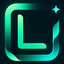

<div align="center">

# Leenium Webpage



**A static dark website for the shared Leenium palette and product ecosystem.**

Hosted under `github.com/drunkleen/leenium.webpage`.

</div>

---

## Pages

- Home
- Palette
- VS Code
- Neovim
- Firefox
- OpenCode
- Omarchy

---

## What It Uses

- **Shared palette** - the site follows the same Leenium colors used across the rest of the repo
- **Dark-only UI** - built around a single low-glare visual language
- **Static HTML/CSS** - no framework, no build step
- **Local assets** - logos, favicon, and loader are all shipped in the website folder

---

## Local Preview

Open `index.html` directly in a browser, or serve the folder with any static file server.

```bash
python -m http.server
```

Then open the local address shown in the terminal.

---

## Notes

- The palette page is the source of truth for the website colors.
- Product pages link back to the matching Leenium repos and previews.
- The site is intentionally minimal and hand-authored.

---

## License

MIT © [Leenium](LICENSE)
